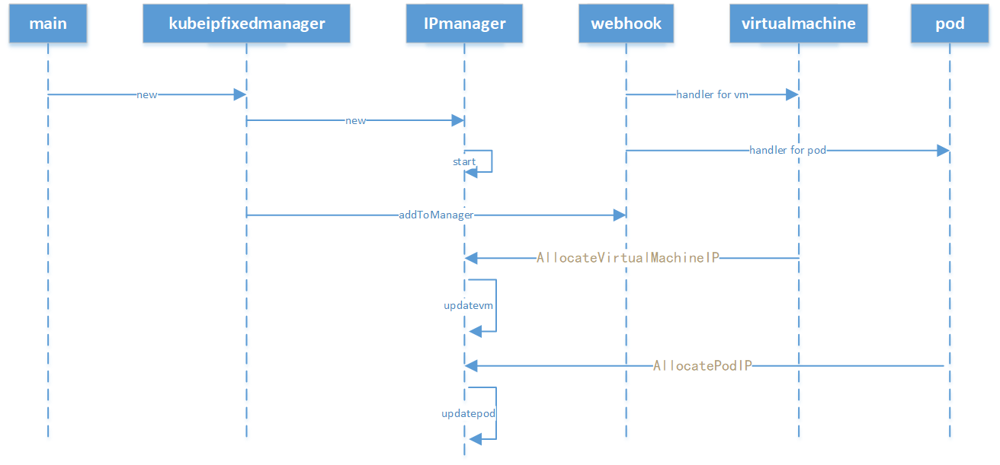

# kubeipfixed

设计参考`kubemacpool`项目

### todo

1、k8s webhook 启动与部署

可参考`kubemacpool`项目的启动与部署，它使用了项目`github.com/qinqon/kube-admission-webhook`作为`webhook`的启动和证书配置。

2、kubeipfixed的webhook pod 业务实现

参考《轻量化底座固定sriov IP方案》

3、kubeipfixed的webhook vm业务实现

参考《轻量化底座固定sriov IP方案》

4、kubeipfixed的测试用例编写

5、kubeipfixed的文档整理与编写
